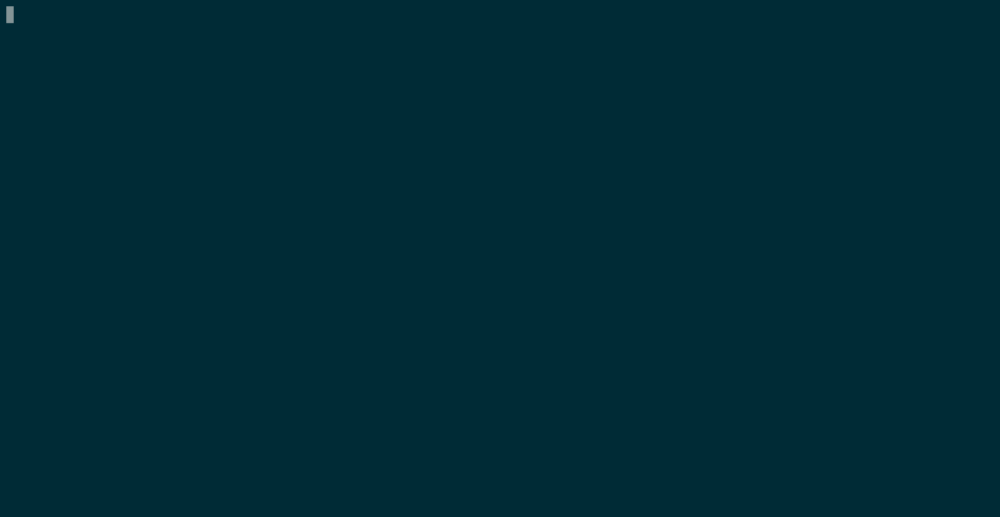
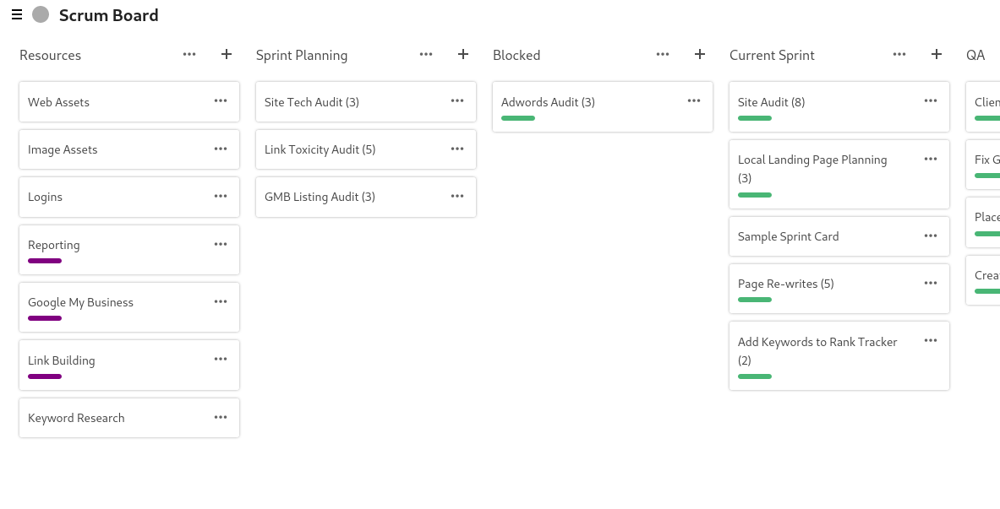

# trello-to-deck
> Move to the bright side!

trello-to-deck reads from an JSON export of Trello and creates a board in [Nextcloud Deck](https://apps.nextcloud.com/apps/deck).






## Installation

```
pip install git+https://github.com/maxammann/trello-to-deck
```
Note: You should not execute this command as `root`. Install it as your normal user and add `~/.local/bin/` to your path.

After that you should be able to execute the command `trello-to-deck` to view the help.

## Usage example

First get a JSON export of your Trello board as described [here](https://help.trello.com/article/747-exporting-data-from-trello-1) and save it as trello.json. Make sure not to delete the board before the migration. Else all attachments are lost!

Then simply invoke the CLI tool `trello-to-deck`:

```console
# trello-to-deck
usage: trello-to-deck [-h] input_json nextcloud_instance username password
trello-to-deck: error: the following arguments are required: input_json, nextcloud_instance, username, password
```

You have to provde the arguments `input_json` e.g. `trello.json`, `nextcloud_instance` e.g. `https://example.org/nextcloud` and the `username` and `password` for nextcloud. If you have 2-FA please create a temporary app passowrd for converting to Deck.

## MUST READ: What is NOT migrated?

* Creating archived cards: https://github.com/maxammann/trello-to-deck/issues/1
  I have over 2000 archived cards in my personal Trello. Right now Deck can not handle this amount. Therefore currenlty no archived cards are migrated!
* Assigning the correct people on the cards. Only the creating account is assigned right now: https://github.com/maxammann/trello-to-deck/issues/7 https://github.com/maxammann/trello-to-deck/issues/6
* Votes: https://github.com/maxammann/trello-to-deck/issues/3
* Background: https://github.com/maxammann/trello-to-deck/issues/5
* Cards of archived stacks: https://github.com/maxammann/trello-to-deck/issues/10

## What is migrated?

* Labels
* Stacks
* Cards
* Checklists (yes they are supported by Deck!)
* Due-date
* Order of Stacks, Cards, Checklists etc.
* Link/Reference to the original trello card (as comment)
* Comments on cards: https://github.com/maxammann/trello-to-deck/issues/4
* Attachments: https://github.com/maxammann/trello-to-deck/issues/2
  
